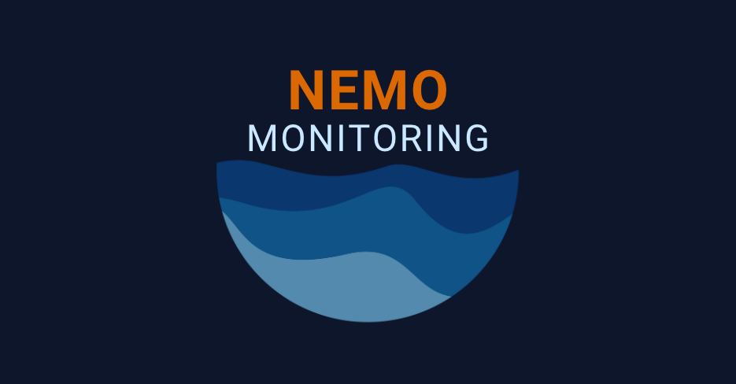

<div align="center">
  
</div>

<br/>

<div align='center'>

[](https://www.javascript.com/)
[](https://react.dev/)
[](https://nodejs.org/en)
[](https://expressjs.com/)
[](https://kubernetes.io/)
[](https://www.mongodb.com/)


[](Tailwind-url)
[](https://d3js.org/)
[](https://www.chartjs.org/)
[](https://mochajs.org/)
[](Chai-url)
[](https://jestjs.io/)

</div>

<p align="center">
Nemo provides Kubernetes cluster monitoring and data visualization in a simple and easy to understand user interface.<br/>Check out our website <a href="http://www.nemomonitoring.com/">here</a>!
</p>

<details>
  <summary><strong>Table of Contents</strong></summary>
  <ul>
    <li><a href="#features">Features</a></li>
    <li><a href="#demo">Demo</a></li>
    <li><a href="#getting-started">Getting Started</a></li>
    <li><a href="#how-to-contribute">How to Contribute</a></li>
    <li><a href="#meet-the-team">Meet the Team</a></li>
  </ul>
</details>

## Features

- Health monitoring solution focusing on CPU and memory consumption
- Delivers insights in accesible formats, such as tables and graphs
- Provides real-time data from the GKE hosted cluster
- Includes a visualization of cluster structure with color-coded severity indicators

## Demo

<div align="center">
  
</div>
  
## Getting Started

- [ ] Step 1A: Ensure that you are connected to a Kubernetes cluster and that you have a valid kubeconfig file. Kubectl should be installed as well.
- [ ] Step 1B: To see available Kubernetes clusters, one can run `kubectl config get-contexts` from the command line. To change the active cluster, one can run `kubectl config use-context <name>`, where `<name>` represents the name of the cluster you want to monitor.
- [ ] Step 2: Clone the repository
```
git clone https://github.com/oslabs-beta/nemo.git
```
- [ ] Step 3: Install all the necessary dependencies in the server and client directories
```
npm install
```
- [ ] Step 4: Run npm start in server and client directories:
```
npm start
```      
  
## How To Contribute

1. Fork the Project
2. Create your Feature Branch (`git checkout -b NewFeature`)
3. Commit your Changes (`git commit -m 'Added a NewFeature'`)
4. Push to the Branch (`git push origin NewFeature`)
5. Open a Pull Request

Features yet to be added:
- Test compatability with clusters hosted on AKS and EKS
- Cost Analysis
- Implement end to end testing
- Implement React Testing Library
- Add historical data as graphs
- Create a notification that alerts the user when parts of their cluster is being overly taxed

## Meet the Team

| Name              | GitHub                                                       | LinkedIn                                                     |
|-------------------|--------------------------------------------------------------|--------------------------------------------------------------|
| Ari Benkov        | [](https://github.com/abenkov2) | [](https://www.linkedin.com/in/ari-benkov-787b25139/) |
| Paul Burger       | [](https://github.com/pvburger) | [](https://www.linkedin.com/in/pvburger/) |
| Anthony Chaiditya | [](https://github.com/AnthonyChaiditya) | [](https://www.linkedin.com/in/anthony-chaiditya/) |
| Trevor Hilz       | [](https://github.com/Maelstrom116) | [](https://www.linkedin.com/in/trevor-hilz/) |
| Callum Miles      | [](https://github.com/callummiles) | [](https://www.linkedin.com/in/callum-miles/) |

## License

Nemo is an open source product licensed under the MIT license, and is accelerated by [OSLabs](https://www.opensourcelabs.io/).


